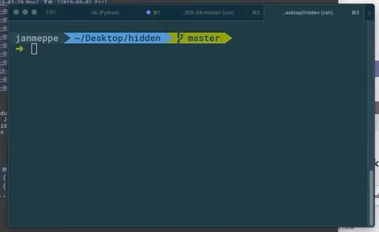

# Hidden

Are you in an open office? Do you want some privacy when you are writing a note
to yourself? 

Try **hidden** now! 

## Installation

To install  

    git clone https://github.com/Rainymood/hidden
    cd hidden/
    python hidden.py

## Usage

To use

    $ hidden
    Note: *******
    Adding note to ./notes.org...

To view your note

    $ cat notes.org
    [2019-08-12 Mon 14:12]
    Hello world!

## TODO

- Installation with `pip install hidden`. 
- Write output to other filepaths, `with open(filepath, "a+")` seems to break for some
  reason. 
